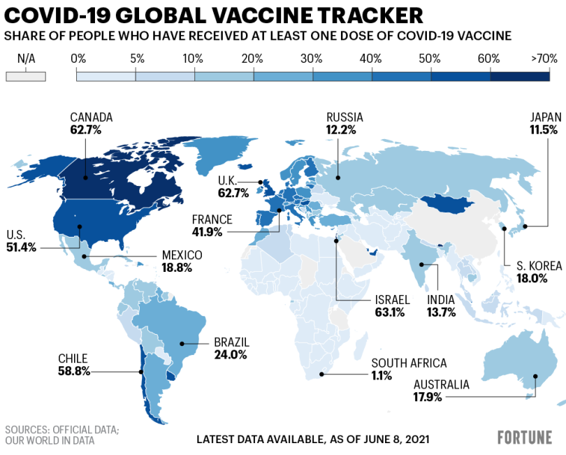

# Vectors {#intro}


## Lecture slides

```{r, comment=NA, message=FALSE, echo=FALSE}
knitr::include_url("https://hellor.netlify.app/2021/week1/l12021.html#1")

#<iframe seamless width="500%" height="500%" frameborde="0" #src="https://hellor.netlify.app/2021/week1/l12021.html#1"></iframe>

```


## Familiarization with the basics of R programming{#basics}

1. Type the following commands on your R console.

```{r, eval=FALSE}
normal <- rnorm(10)
normal
vector <- c(10, 20, 30)
vector
x <- 1:100
x
y <- rnorm(100)
y
plot(x, y)
```

2. The workspace is where user-defined objects accumulate. Use `ls` to get a list of the objects in the workspace.

3. Each object in R has a data type: 

    i) `numeric` (number - `integer` or `double`), 
    
    ii) `integer` (eg: 100L, where the letter "L" declares this as an integer)
    
    iii) `character` (text), 
    
    iv) `logical` (TRUE / FALSE), 
    
    v) `complex` (2 + 3i, where "i" is the imaginary part)
    
    The function `typeof` can be used to assess the type of an object; and the function `class` can be used to assess the class attribute of an object. For example

```{r, comment=NA}
a <- c(10, 20, 30)
typeof(a)
class(a)
```

explore the type attribute and class type of the following objects.

```{r, eval=FALSE}
v1 <- c(10L, 20L, 30L)
v2 <- c(9i+3, 2i+5, 3i+2, 5i+1)
v3 <- "R programming is fun."
v4 <- TRUE
v5 <- c(TRUE, FALSE, TRUE, FALSE)
v6 <- c(10, 20, 30, 40, 100)

```

4. Write an R code to store the data presented in the map.



source: https://fortune.com/2021/06/09/covid-vaccine-rates-world-map-vaccination-by-country/

## Creating vectors

1. Write R codes to create following vectors    

      (a) 5, 12, 32, 50, 100000

      (b) 1, 2, 3, ..., 100.

      (c) 2, 4, 6, 8, ..., 100.

     (d) vector (3, 3, 3, . . . 3, 6, 6, . . . 6, 9, 9, 9, . . . 9), where there are 10 occurrences of 3, 20 occurrences of 6 and 30 occurrences of 9.

2. Generate a sequence using the code `seq(from=1, to=10, by=1)`. What other ways can you generate the same sequence?


3. Using the function  `rep()`, to create the  sequence `1, 2, 3, 4, 1, 2, 3, 4, 1, 2, 3, 4`

4. Create a vector that shows the square root the integers from 1 to 100.

5. Create a vector with elements from 1 to 100 incrementing by 0.4. Your output should look like the sample output given below.

```{r, comment=NA, echo=FALSE}
seq(1, 100, by=0.4)
```


6. Observe the differences in running the following codes.

```{r, comment=NA}
vec1 <- 1.8:20.8
vec1
```

```{r, comment=NA}
vec2 <- 1.8:30
vec2

```


## Object classes and type of objects

7. Use `typeof` to identify the storage mode of the following objects and `class` to identify object classes.

```{r, comment=NA}
a <- c("MON", "TUES", "WED", "THUR", "FRI")
```

```{r, comment=NA}
b <- c(1, 2, 3, 4, 5)
```

```{r, comment=NA}
c <- c(1L, 2L, 3L, 4L, 5L)
```

```{r, comment=NA}
d <- c(TRUE, FALSE, TRUE, TRUE)
```

```{r, comment=NA}
e <- c(2+3i, 1+2i, 5+3i)
```

```{r, comment=NA}
f <- c("MON", TRUE, 1, 1L)
```

8. Explore comment on the output of following vector functions. 

```{r, comment=NA}
a1 <- vector("numeric", 8)
a2 <- vector("complex", 8)
a3 <- vector("logical", 8)
a4 <- vector("character", 8)

b1 <- numeric(8)
b2 <- complex(8)
b3 <- logical(8)
b4 <- character(8)

```

## Subsetting of vectors

9. Consider the vector `x`. 

```{r}
x <- 1:10

```

What does each of the following codes do?

```{r, comment=NA, eval=FALSE}
x[3]

x[c(2, 4)]

x[-1]

x[c(2, -4)]

x[c(2.4, 3.54)]

```

```{r, comment=NA, eval=FALSE, echo=FALSE}
x[3] # print the 3rd element

x[c(2, 4)] # print the 2nd and 4th elemen

x[-1] # print all except 1st

x[c(2, -4)] # Cannot mix positive and negative

x[c(2.4, 3.54)] # real numbers are truncated to integers

```


10. Consider the following vector 

```{r, comment=NA, echo=FALSE}
set.seed(1762021)
st_normal <- rnorm(100)
st_normal
```

You can use the following command to create the above vector.

```{r, comment=NA, eval=FALSE}
set.seed(1762021)
st_normal <- rnorm(100)
st_normal
```

Write an R code to drop the elements corresponds to the positions multiply of 10 (10, 20, 30, ...).

```{r, comment=NA, echo=FALSE, eval=FALSE}
st_normal[-seq(1, 100, by=10)]
```


## Filtering vectors based on conditions

11. Consider the vector 

```{r, comment=NA}
x <- c(80, 39, NA, 51, 51, 11, NA, NA, NA, 100, 80, 70)
```

  (a) Write an R code to extract non-missing values in `x`.

```{r, comment=NA, echo=FALSE, eval=FALSE}
# Answer 4
x[!is.na(x)]

```

  (b) Write an R code to extract missing values and odd-numbers in `x`

```{r, comment=NA, echo=FALSE, eval=FALSE}
x[x %% 2 == 1]
```

  (c) Write an R code to extract odd numbers on `x`

```{r, comment=NA, echo=FALSE, eval=FALSE}
y <- x[x %% 2 == 1]
y[!is.na(y)]
```

  (d) Which values of `x` are NOT in the set `1:50`

```{r, comment=NA, echo=FALSE, eval=FALSE}
x %in% 1:50
```

## Modify a vector

12. Consider the following vector `age` which includes the age of 10 individuals.

```{r}
age <- c(20, 30, 40, 41, 32, 32, 25,  NA, NA, -4, -6, 9999, 10000)
```


(a) Convert all negative values to NA.
    
(b) The valid responses for the age variable are between 0 and 100. Calculate the mean of valid responses.
    

    
13. Consider the following vector of 100 random numbers generated from the standard normal distribution. You can use the code given below to reproduce the vector `b`.

```{r, comment=NA}
set.seed(17620212)
b <- rnorm(100)
b
```

  (a) Change the first five values in the vector to 1.
    
  (b) Change the last five values in the vector to 0.
    
  (c) Assign all values grater than 0.5 to 1 and all values less than 0.5 to 0.
    
  (d) Recode the 0 values to "MALE" and others to "FEMALE"


## Application of vectors

We are in the midst of a medical crisis! The deadly coronavirus  has infected 1 million people worldwide and is now spreading across the globe at an alarming rate. World Health Organization (WHO) alerted the world about the Novel Coronavirus(2019-nCoV) in January, 2020. After issuance of the global alert, a formal reporting of Corona cases was put in place, and WHO published daily reports on the number of cases on their website [here](https://www.who.int/emergencies/diseases/novel-coronavirus-2019/situation-reports). Use WHO: Situation Report-21 for this question. Situation Report - 21 is available [here](https://www.who.int/docs/default-source/coronaviruse/situation-reports/20200210-sitrep-21-ncov.pdf?sfvrsn=947679ef_2).


Table 1 reports the confirmed cases of 2019-nCoV reported by provinces, regions and cities in China.

i) Enter confirmed cases in table 1 to a vector.

ii) Name the elements by province/regions/cities in China.

iii) Write R codes to answer the following questions.

      (a) Which province/region/city has the highest number of confirmed cases?

      (b) Number of confirmed cases reported in Hebei, China.

      (c) Total number of confirmed cases reported in China

      (d) Number of cases reported in the capital of China

      (c) Number of cases reported in Inner Mongolia
