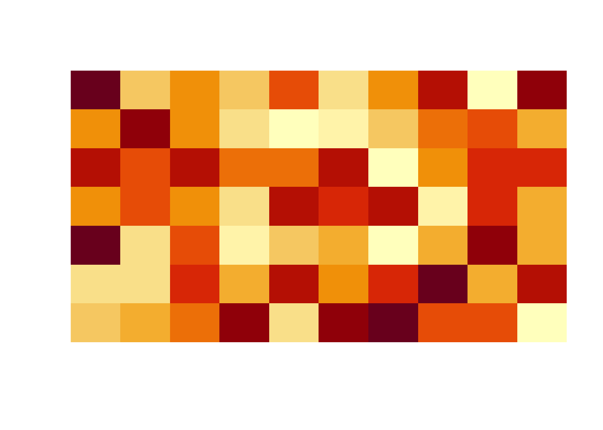

# Matrices, Arrays, Data frames

## Lecture slides

<iframe src="https://hellor.netlify.app/slides/l22021.html#1" width="672" height="400px"></iframe>


## Matrices

Use the code below to create the vector `uniform.values`.


```r
set.seed(21)
uniform.values <- runif(50)
uniform.values
```

```
##  [1] 0.78611493 0.25244560 0.69925230 0.18446075 0.95961383 0.91868340
##  [7] 0.10180455 0.17219168 0.98600368 0.84939610 0.66754012 0.93521022
## [13] 0.05818433 0.61861583 0.17491846 0.03767539 0.52531317 0.28218425
## [19] 0.49904520 0.63382510 0.01139965 0.60785656 0.77559853 0.92397118
## [25] 0.29170673 0.78907624 0.56849721 0.77843508 0.71323253 0.66904867
## [31] 0.93470991 0.50646019 0.74506019 0.83835263 0.86907475 0.19311168
## [37] 0.21633194 0.65042346 0.33516604 0.50765589 0.65283937 0.96557667
## [43] 0.51466067 0.06165677 0.15101646 0.63556589 0.10296050 0.77269430
## [49] 0.41022537 0.87023337
```
 
1. Arrange data in `uniform.values` according to the following formats:

  (a) single row matrix.
    
  (b) single column matrix
    
  (c) matrix $5 \times 10$ 
    
  (d) matrix $10 \times 5$ 
  
2. Write the code to output the following matrix.


```
       [,1]      [,2]      [,3]      [,4]      [,5]      [,6]      [,7]
a 0.7861149 0.2524456 0.6992523 0.1844608 0.9596138 0.9186834 0.1018046
b 0.7890762 0.5684972 0.7784351 0.7132325 0.6690487 0.9347099 0.5064602
       [,8]      [,9]     [,10]     [,11]     [,12]      [,13]     [,14]
a 0.1721917 0.9860037 0.8493961 0.6675401 0.9352102 0.05818433 0.6186158
b 0.7450602 0.8383526 0.8690747 0.1931117 0.2163319 0.65042346 0.3351660
      [,15]      [,16]     [,17]     [,18]      [,19]     [,20]      [,21]
a 0.1749185 0.03767539 0.5253132 0.2821842 0.49904520 0.6338251 0.01139965
b 0.5076559 0.65283937 0.9655767 0.5146607 0.06165677 0.1510165 0.63556589
      [,22]     [,23]     [,24]     [,25]
a 0.6078566 0.7755985 0.9239712 0.2917067
b 0.1029605 0.7726943 0.4102254 0.8702334
```

3. Matrix visualization: The matrix `m` contains 70 randomly generated values from the $Unif(0, 1)$ distribution. The R function `image` is used to visualize the matrix.  


```r
set.seed(1)
values <- runif(70)
m <- matrix(values, 10, 7)
m
```

```
            [,1]      [,2]       [,3]      [,4]      [,5]       [,6]       [,7]
 [1,] 0.26550866 0.2059746 0.93470523 0.4820801 0.8209463 0.47761962 0.91287592
 [2,] 0.37212390 0.1765568 0.21214252 0.5995658 0.6470602 0.86120948 0.29360337
 [3,] 0.57285336 0.6870228 0.65167377 0.4935413 0.7829328 0.43809711 0.45906573
 [4,] 0.90820779 0.3841037 0.12555510 0.1862176 0.5530363 0.24479728 0.33239467
 [5,] 0.20168193 0.7698414 0.26722067 0.8273733 0.5297196 0.07067905 0.65087047
 [6,] 0.89838968 0.4976992 0.38611409 0.6684667 0.7893562 0.09946616 0.25801678
 [7,] 0.94467527 0.7176185 0.01339033 0.7942399 0.0233312 0.31627171 0.47854525
 [8,] 0.66079779 0.9919061 0.38238796 0.1079436 0.4772301 0.51863426 0.76631067
 [9,] 0.62911404 0.3800352 0.86969085 0.7237109 0.7323137 0.66200508 0.08424691
[10,] 0.06178627 0.7774452 0.34034900 0.4112744 0.6927316 0.40683019 0.87532133
```

```r
image(m, useRaster=TRUE, axes=FALSE)
```



a) Record the values in the matrix (m) as follows: matrix value = 0 if value lessthan 0.5 and 1 otherwise. Write an R code to visualize the new matrix.


b) Consider the matrix `ymat` given below. Convert all even index position values to 0 and odd position values to 1. 


```
      [,1] [,2] [,3] [,4] [,5] [,6] [,7] [,8] [,9] [,10]
 [1,]   10  110  210  310  410  510  610  710  810   910
 [2,]   20  120  220  320  420  520  620  720  820   920
 [3,]   30  130  230  330  430  530  630  730  830   930
 [4,]   40  140  240  340  440  540  640  740  840   940
 [5,]   50  150  250  350  450  550  650  750  850   950
 [6,]   60  160  260  360  460  560  660  760  860   960
 [7,]   70  170  270  370  470  570  670  770  870   970
 [8,]   80  180  280  380  480  580  680  780  880   980
 [9,]   90  190  290  390  490  590  690  790  890   990
[10,]  100  200  300  400  500  600  700  800  900  1000
```

 

Help:


```r
5 %% 2
```

```
[1] 1
```

```r
6 %% 2
```

```
[1] 0
```

Visualize the matrix using the `image` function. Your output should look like this:


## Array

Write R codes to create the following arrays.

(a)


```
, , Matrix1

     COL1 COL2 COL3
ROW1    1   10   13
ROW2    2   11   14
ROW3    3   12   15

, , Matrix2

     COL1 COL2 COL3
ROW1    1   10   13
ROW2    2   11   14
ROW3    3   12   15
```

(b)


```
, , 1

     [,1] [,2] [,3]
[1,]    2    4    6
[2,]    3    5    7

, , 2

     [,1] [,2] [,3]
[1,]    8   10   12
[2,]    9   11   13
```


## Dataframe

1. Store the following values into a data frame.


