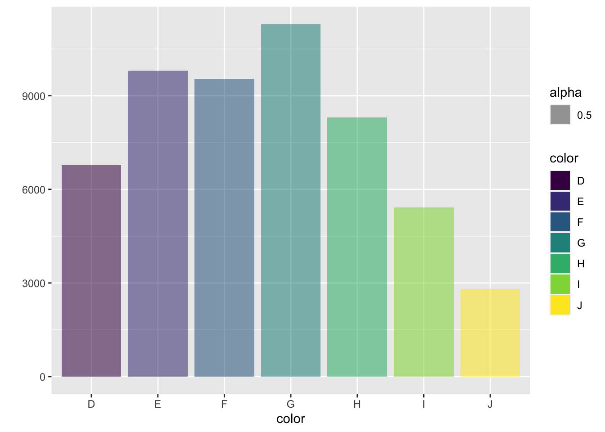
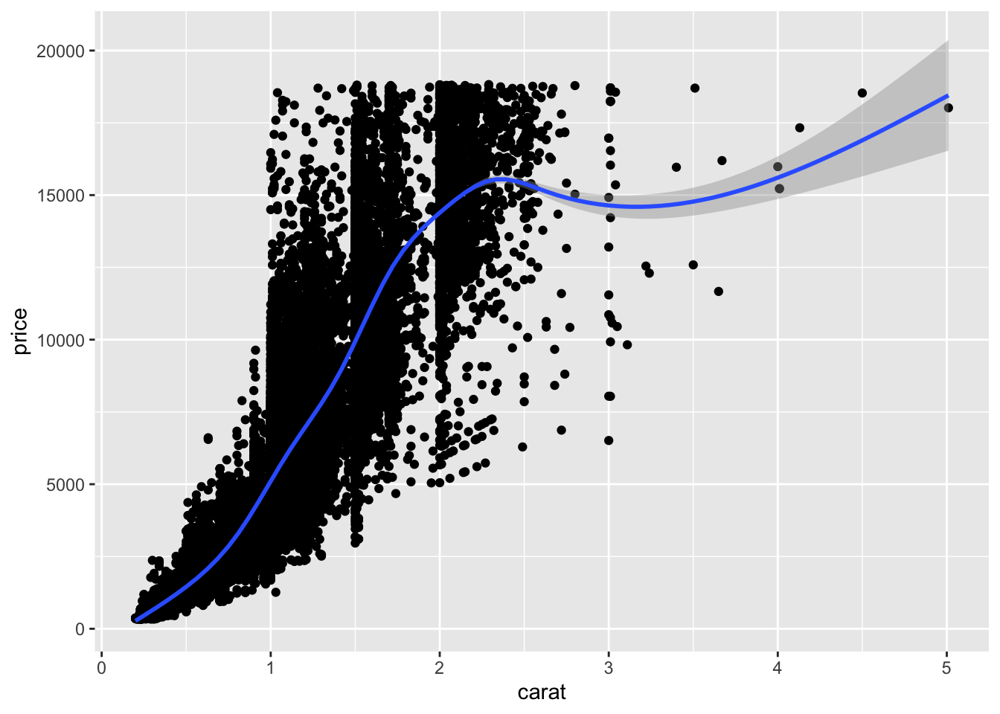
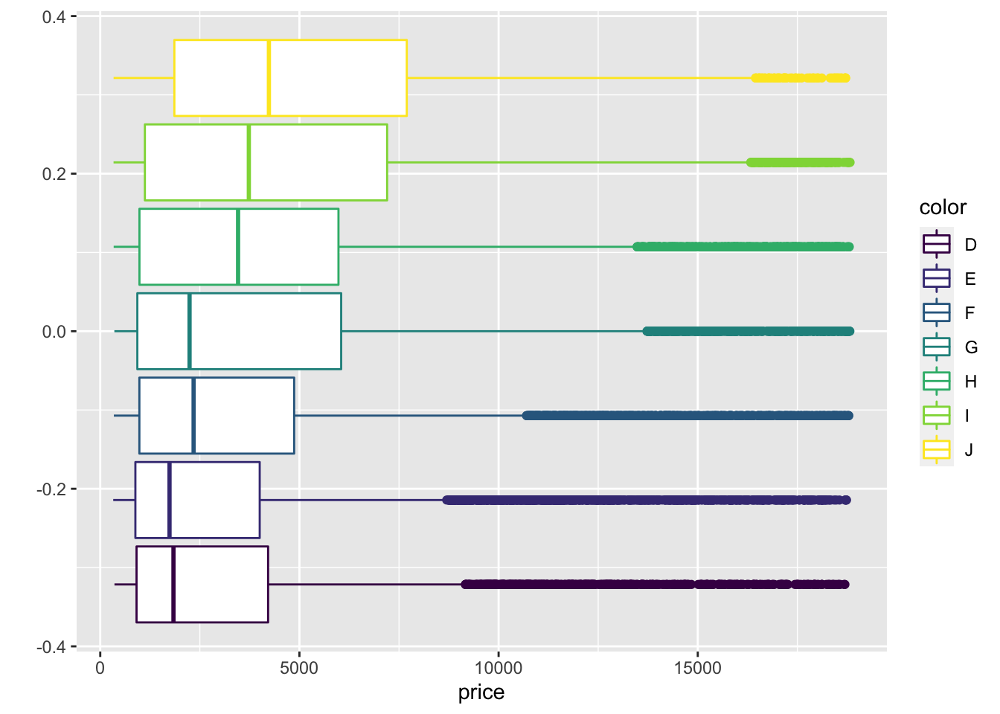
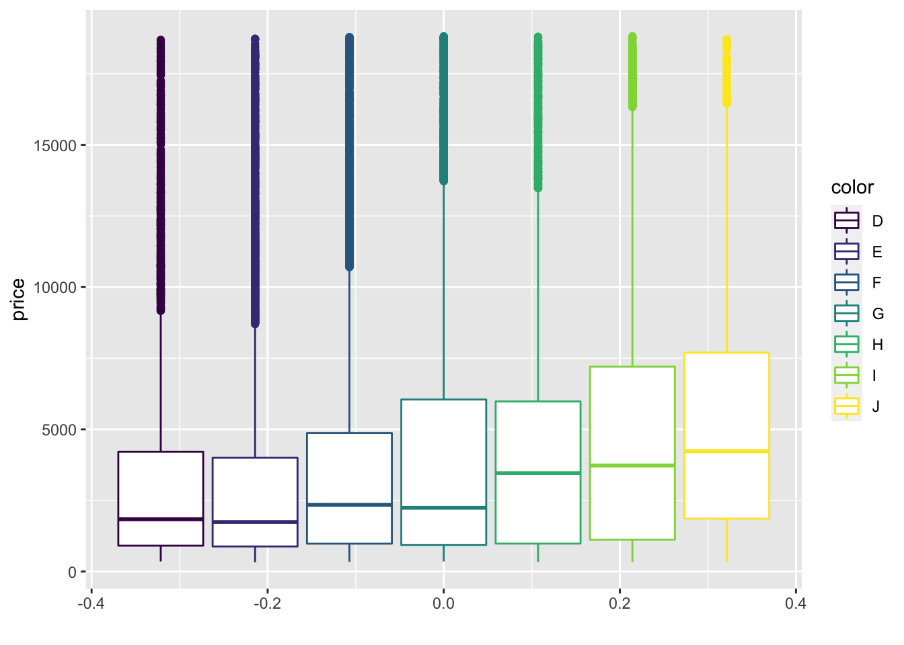
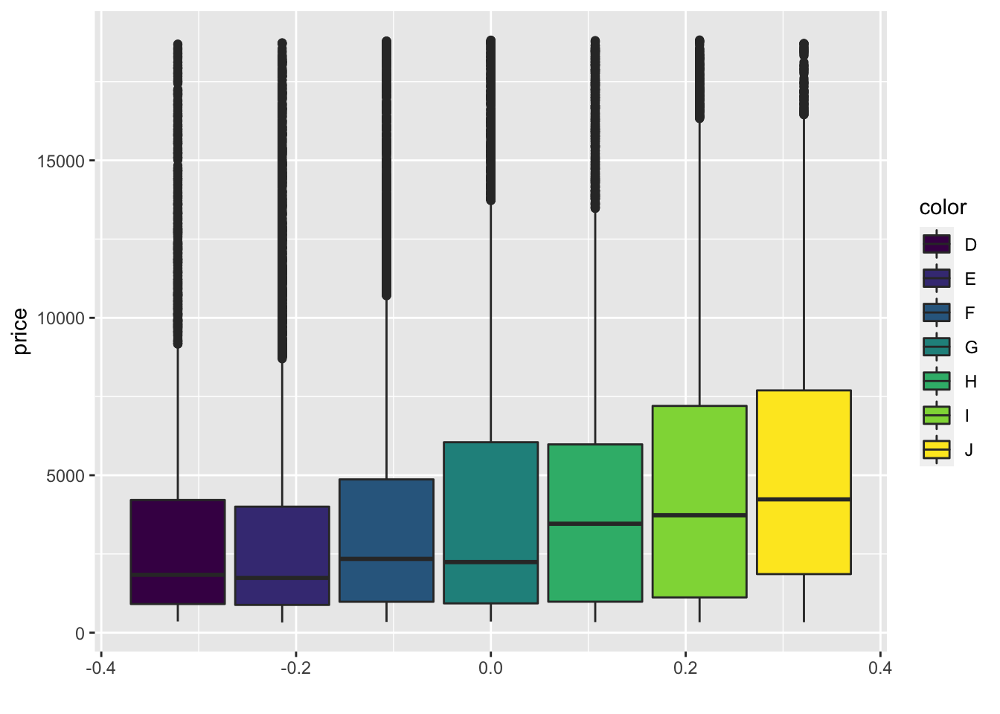
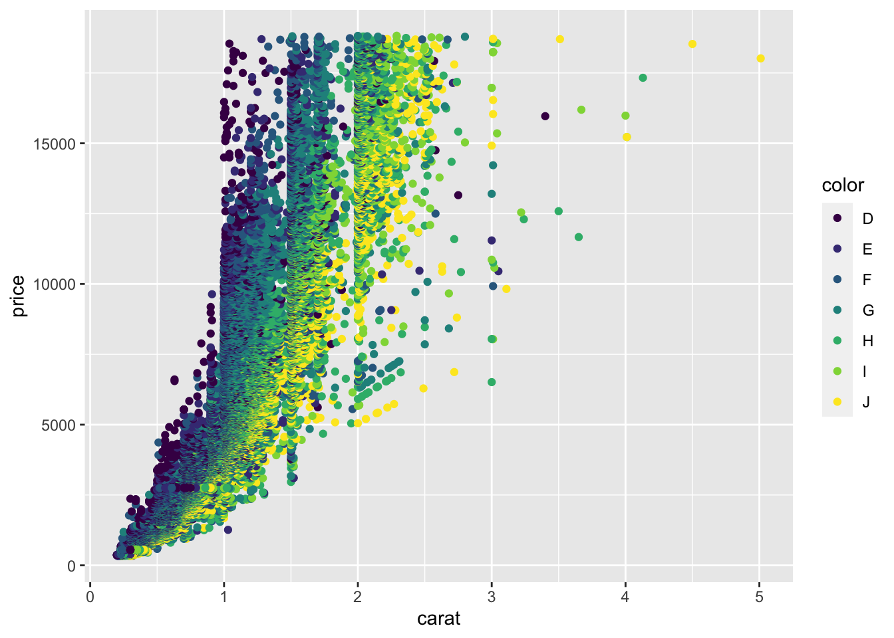
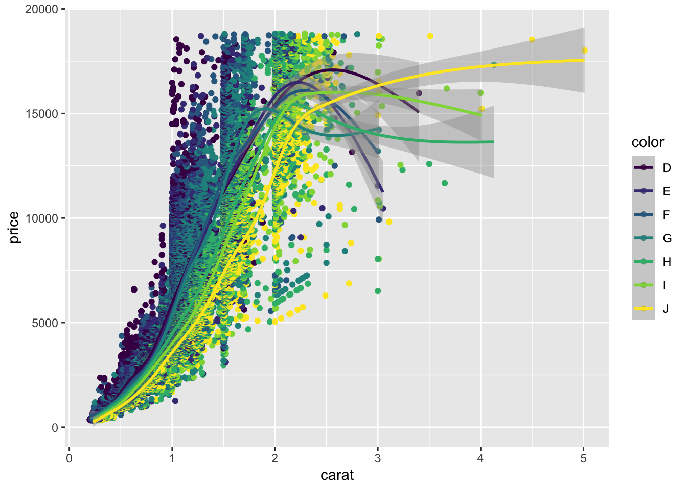

# Data Visualization with R: qplot

## Lecture slides


<iframe src="https://hellor.netlify.app/slides/l42021.html#1" width="672" height="400px"></iframe>

## Visualizing the `diamonds` dataset using R


This question is based on diamonds dataset in `ggplot2` package. Load the `ggplot2` package and the `diamonds` dataset using the following command.


```r
library(ggplot2)
data("diamonds")
```


To find out what information there is about the dataset, you can run the command:


```r
help(diamonds)
```


There are over 50000 observations and 10 variables in the diamond dataset. Write down the R codes to reproduce the following graphic outputs.

a. 



Help: use `fill` option to assign colours and `alpha` option to add transparency to the bars.

b. 



Help: use geoms, `point` and `smooth`.

c. 



d. 




e. 




f. 



g. 




\newpage


## Answers 
    
**Section 4.3**

a. 


```r
library(ggplot2)
data(diamonds)
qplot(color, data = diamonds, geom = "bar", fill = color, alpha = 0.5) 
```


b. 


```r
qplot( data = diamonds, carat, price, geom = c("point", "smooth"))
```


c. 


```r
qplot(data = diamonds, x = price, color = color, geom = 'boxplot' )
```

d. 


```r
qplot(data = diamonds, y = price, color = color, geom = 'boxplot' )
```

e. 


```r
qplot(data = diamonds, y = price, fill = color, geom = 'boxplot' )
```

f. 


```r
qplot( data = diamonds, carat, price, colour=color, geom = "point")
```

g. 


```r
qplot( data = diamonds, carat, price, colour=color, geom = c("point", "smooth"))
```


    
    


