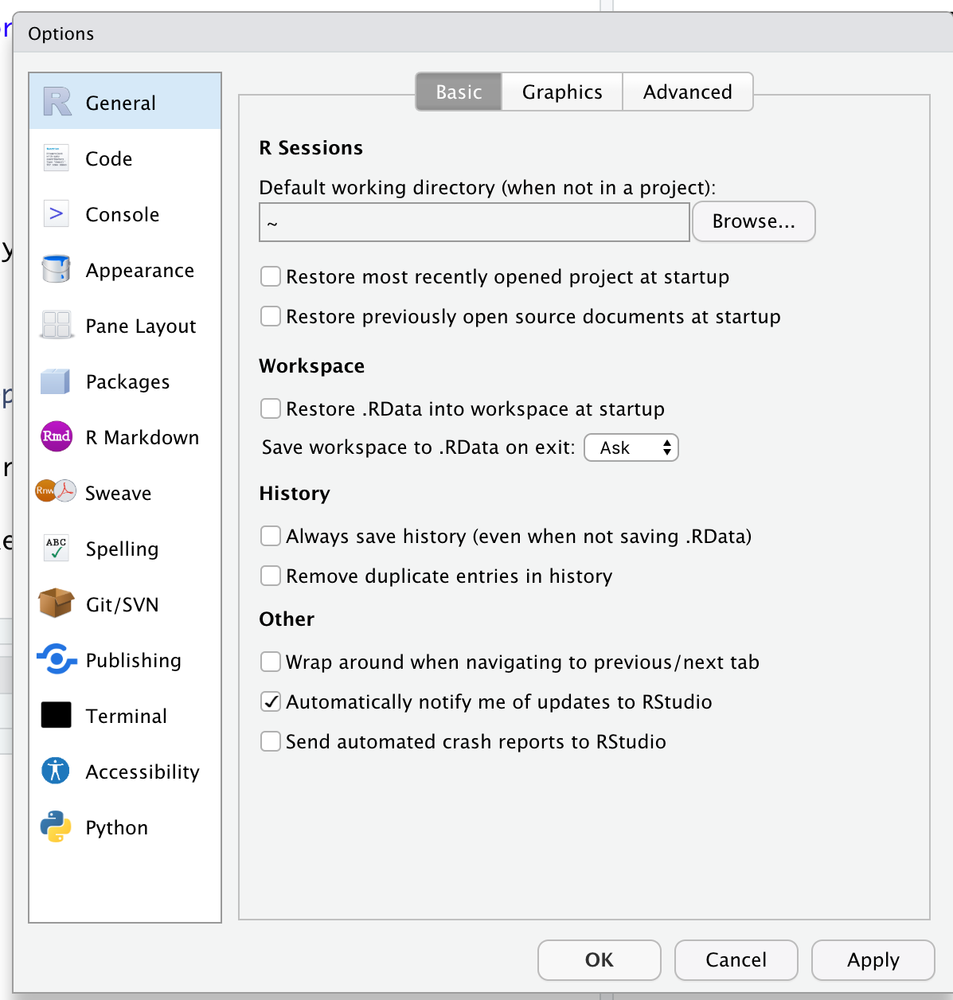

--- 
title: "Programming and Data Analysis with R"
author: "Thiyanga S. Talagala"
date: "`r Sys.Date()`"
site: bookdown::bookdown_site
documentclass: book
bibliography: [book.bib, packages.bib]
biblio-style: apalike
link-citations: yes
description: "This book contains the tutorials for STA 326 2.0/ ASP 454 2.0 Programming and Data Analysis with R."
---

# R and RStudio

## Lecture note

```{r, comment=NA, message=FALSE, echo=FALSE}
knitr::include_url("https://hellor.netlify.app/2021/week1/l12021.html#1")

#<iframe seamless width="500%" height="500%" frameborde="0" #src="https://hellor.netlify.app/2021/week1/l12021.html#1"></iframe>

```

## Exercise

1. Create a new project in the RStudio IDE. Name your project as "sta326".

2. Select a suitable theme for your RStudio IDE's user interface. 

    Help: Navigate to Tools > Global Options > Appearance .
    
3. Go to `Tools > Global Options > General` and set the settings as follows:



4. Change the RStudio pane layout according to needs.

    Help: Tools > Global options > Pane layout and fix it.

5. Create a new folder called `weeek1` inside your main  R project.

6. Open a new script file and save it as week1_exercise.R inside the `week1` folder created in the third step.

7. Go to Exercise 2 and write all codes on the R script `week1_exercise.R`


